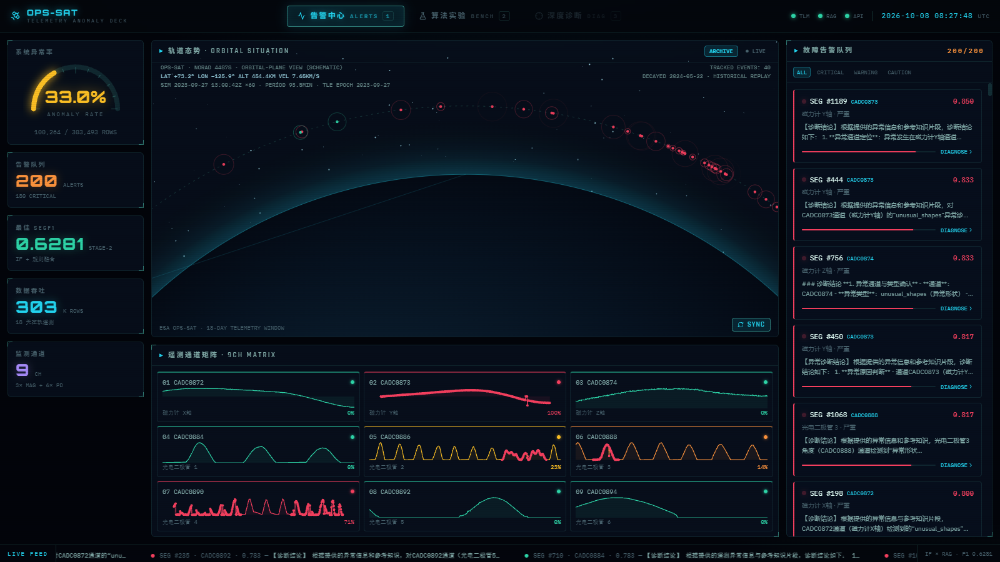
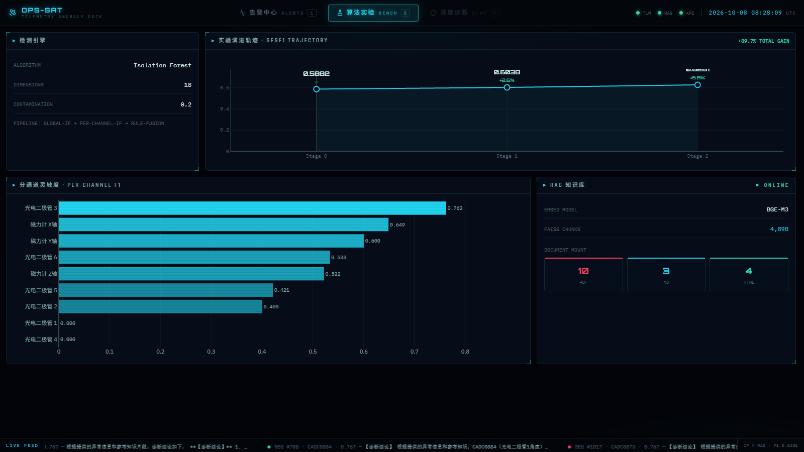
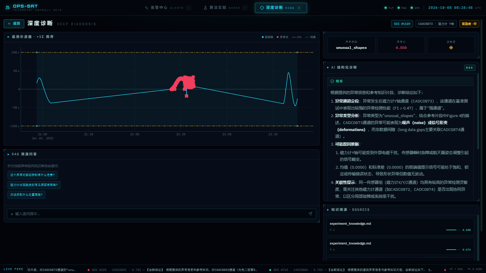

# 微小卫星遥测智能异常检测与RAG解释辅助系统

> Shanghai Dianji University — 大学生创新创业训练计划项目
> 周期：2026.4 - 2027.3 | 指导教师：芦立华

<p align="center">     </p>

卫星遥测数据里异常很多，但没人知道**为什么**异常。本项目做两件事：用 Isolation Forest 把异常段检出来，再用 RAG 结合卫星手册知识库，让 LLM 把异常讲清楚，并给出可溯源的依据。

**数据规模**：基于 ESA OPS-SAT 公开数据集 —— 30.3 万行采样点 / 2123 段 / 9 通道 / 段级异常率 20.4%。

<p align="center">
    
</p>

## 关键结果

| 指标 | 结果 |
|---|---|
| 段级 F1 | 0.5882 → **0.6281**（+6.8%） |
| 告警误报 | **20 → 0** |
| RAG 引用溯源 | **200 / 200** |
| 检索中位耗时 | **25 ms** |
| 向量化加速（GPU vs CPU） | 128 条 2.17 s → 0.26 s（**8.3×**） |
| 知识库规模 | **4,898** 分块 |

## 30 秒上手

```bash
git clone -b main https://github.com/Jerry518520/microsat-anomaly-analysis.git
cd microsat-anomaly-analysis
python scripts/start_ui.py
```

打开 http://localhost:5180。仅看检测看板可不配 API Key；RAG 解释需在 `.env` 配置 Key。

## 技术架构

```
┌───────────────────────────────────────────────────────┐
│            前端  React 19 + TypeScript                │
│   Dashboard · Detection · Explainer · Settings        │
└───────────────────────────────────────────────────────┘
                          │  REST + WebSocket
                          ▼
┌───────────────────────────────────────────────────────┐
│                  FastAPI 后端                         │
│  /api/dashboard · /api/detection · /api/explanation   │
│  /api/stream                                          │
└───────────────────────────────────────────────────────┘
                          │
                          ▼
┌───────────────────────────────────────────────────────┐
│      特征工程 → 异常检测 → 门控融合 → RAG 解释        │
│   18 维段级特征   Isolation Forest   规则引擎         │
└───────────────────────────────────────────────────────┘
                          │
                          ▼
┌───────────────────────────────────────────────────────┐
│  FAISS 向量库 · BGE-M3 · DeepSeek V3 · SQLite         │
└───────────────────────────────────────────────────────┘
```

| 层次 | 技术 |
|------|------|
| 前端 | React 19 + TypeScript + Vite + Tailwind CSS |
| 后端 | FastAPI + Uvicorn（REST + WebSocket） |
| 异常检测 | 18 维段级特征 + 分通道自适应 Isolation Forest + 规则引擎门控融合 |
| 检索增强 | LlamaParse / BGE-M3 / FAISS / BM25 |
| LLM | DeepSeek V3 |
| 存储 | SQLite（告警与段判定持久化） |

## 两个值得说的点

**一个明确的工程取舍**：为把检索中位耗时压到 25 ms，主动放弃在线增量写入，改为离线重建索引。代价是知识库更新需要重建索引；收益是检索路径极简、延迟可控。

**定位并修复一类非显性 AI 缺陷**：「防幻觉提示词已写入但未生效」—— 生成内容脱离检索依据，而系统没有任何报错。通过断言校验定位根因后，补充「检索不到即拒答」兜底逻辑与回归测试，防止复发。

## 团队与分工

| 成员 | 职责 | 具体交付物 | 代码合并方式 |
|---|---|---|---|
| **李冰杰**（项目负责人） | 核心算法 + RAG + 系统架构 | 18 维特征工程、门控融合、RAG 全链路、FastAPI 后端、测试与工程规范 | 主分支提交（123 commits） |
| 王翌钧 | 数据处理 + 可视化 + 前端 | `data/` 数据清洗脚本、前端可视化组件 | 本地开发后由负责人 review 合并 |
| 陶诗怡 | 知识库建设 + 成果展示 + 文档 | `docs/knowledge_base/` 文档整理与校对 | 文档直接提交 |

> 说明：代码统一由负责人 review 后合并提交，故 GitHub 贡献者图仅显示 1 人；实际分工与交付物如上表。

## 关于 AI 辅助开发

架构设计、Prompt 工程、评测口径与失效定位由本人主导；样板代码与重复性实现使用 AI 编程工具生成，生成结果逐段 review 后入库并补单元测试。上文的防幻觉失效定位即为人工校验环节发现的典型问题。

## 目录结构

```
microsat-anomaly-analysis/
├── src/            # 特征工程 / 异常检测 / 门控融合 / RAG / FastAPI 后端
├── frontend/       # React 19 + TypeScript 前端
├── configs/        # 全局参数与 RAG 配置
├── data/           # 遥测数据、实验结果、向量索引
├── models/         # BGE-M3 嵌入模型（不入 git）
├── scripts/        # 建索引 / 实验 / 一键启动
├── docs/           # 知识库、论文与项目文档
└── tests/          # pytest 测试
```

| 文档 | 内容 |
|---|---|
| [`DEPLOY.md`](DEPLOY.md) | 从零克隆部署；实时数据接入（`ingest` / `replay`、WebSocket 告警） |
| [`API.md`](API.md) | 后端接口契约（路径、字段、严重度阈值） |
| [`docs/指标口径说明.md`](docs/指标口径说明.md) | 段级 / 点级异常率两套口径的定义与区别 |

---

## 项目概述

本项目基于 **ESA OPS-SAT 卫星遥测数据集**，实现了一套完整的微小卫星遥测异常检测与智能解释系统：

1. **Isolation Forest 异常检测**：分通道自适应段级特征检测
2. **特征贡献度分析**：解释哪些特征驱动异常判定
3. **RAG 辅助解释**：结合卫星手册知识库，用 LLM 生成异常原因的自然语言解释
4. **Web 可视化平台**：FastAPI + React 前后端分离架构，集成检测+解释+可视化

### 核心功能

| 功能模块 | 说明 | 状态 |
|---------|------|------|
| 异常检测引擎 | Isolation Forest 分通道检测 | ✅ 完成 |
| 特征工程 | 18维段级特征提取 | ✅ 完成 |
| RAG 解释系统 | FAISS + BGE-M3 + DeepSeek | ✅ 完成 |
| FastAPI 后端 | REST API 接口 | ✅ 完成 |
| React 前端 | 可视化诊断界面 | ✅ 完成 |
| Streamlit 旧版 | 早期原型 (已弃用) | ⚠️ 维护模式 |

---

## 团队成员

| 成员 | 年级 | 职责 | 联系方式 |
|------|------|------|----------|
| 李冰杰 | 23级 | 核心算法 + RAG + 系统架构 | - |
| 王翌钧 | 25级 | 数据处理 + 可视化 + 前端 | - |
| 陶诗怡 | 25级 | 知识库建设 + 成果展示 + 文档 | - |

---

## 项目结构

```
microsat-anomaly-analysis/
├── .env                          # 环境变量 (API Key 等，不提交 git)
├── .gitignore                    # Git 忽略规则
├── .streamlit/                   # Streamlit 配置
│   └── config.toml
├── configs/                      # 配置文件
│   ├── config.yaml               # 全局参数配置
│   ├── rag_config.yaml           # RAG 系统配置
│   └── run_config.json           # 运行时配置
├── data/                         # 数据目录
│   ├── raw/                      # 原始数据 (segments.csv, 合成特征.csv)
│   ├── processed/                # 处理后的特征数据
│   ├── results/                  # 实验结果 (JSON, 图表)
│   ├── vectorstore/              # FAISS 向量索引
│   └── embeddings_cache/         # 嵌入向量缓存
├── docs/                         # 文档
│   ├── knowledge_base/           # RAG 知识库源文件 (PDF/MD)
│   ├── paper/                    # 论文相关
│   ├── papers/                   # 参考文献
│   └── *.md                      # 项目文档
├── frontend/                     # React 前端
│   ├── src/                      # 前端源码
│   │   ├── App.tsx               # 主应用 (单文件，含所有页面)
│   │   ├── main.tsx              # 入口
│   │   └── index.css             # 全局样式
│   ├── package.json              # Node.js 依赖
│   ├── vite.config.ts            # Vite 配置
│   └── tsconfig.json             # TypeScript 配置
├── models/                       # 预训练模型 (不提交 git)
│   └── Xorbits/bge-m3/           # BGE-M3 嵌入模型
├── notebooks/                    # Jupyter 实验笔记本
├── scripts/                      # 脚本
│   ├── build_index.py            # 构建 FAISS 索引
│   ├── run_rag_experiment.py     # RAG 实验脚本
│   ├── start_server.bat          # Windows 启动脚本
│   ├── start_ui.py               # 一键启动前后端
│   └── gen_ppt_diagrams.py       # 生成 PPT 图表
├── src/                          # Python 源码
│   ├── api/                      # FastAPI 后端
│   │   ├── main.py               # FastAPI 入口
│   │   ├── models.py             # 数据模型
│   │   └── routes/               # API 路由
│   │       ├── dashboard.py      # 仪表盘 API
│   │       ├── detection.py      # 检测 API
│   │       └── explanation.py    # 解释 API
│   ├── evaluation/               # 评估模块
│   │   ├── metrics.py            # F1, AUC_ROC 等指标
│   │   └── feature_importance.py # 特征贡献度分析
│   ├── experiments/              # 实验脚本
│   │   ├── baseline_rerun.py     # 基准实验
│   │   └── fair_comparison.py    # 公平对比实验
│   ├── features/                 # 特征工程
│   │   ├── segment_features.py   # 段级特征 (baseline)
│   │   └── extract_segments_18d.py # 18维特征提取
│   ├── integration/              # 集成模块
│   │   └── anomaly_rag_pipeline.py # 异常检测+RAG完整流程
│   ├── models/                   # 模型
│   │   └── iforest_baseline.py   # IForest 基准模型
│   ├── rag/                      # RAG 解释模块
│   │   ├── embedding.py          # BGE-M3 嵌入
│   │   ├── llm_client.py         # LLM API 客户端
│   │   ├── pipeline.py           # RAG 流程
│   │   ├── prompts.py            # Prompt 模板
│   │   └── vectorstore.py        # FAISS 向量库
│   ├── ui/                       # Streamlit UI (旧版)
│   │   └── app.py                # Streamlit 入口
│   └── utils/                    # 工具模块
│       ├── constants.py          # 常量定义
│       ├── data_loader.py        # 数据加载
│       ├── results_loader.py     # 结果加载
│       ├── stat_rules.py         # 统计规则
│       └── visualization.py      # 可视化工具
├── tests/                        # 测试
│   ├── test_rag/                 # RAG 模块测试
│   └── output/                   # 测试输出 (gitignore)
├── pyproject.toml                # Poetry 项目配置
├── requirements.txt              # pip 依赖
├── poetry.lock                   # Poetry 锁定文件
├── README.md                     # 本文件
└── DEPLOY.md                     # 部署指南
```

---

## 数据集说明

### 数据来源

基于 **ESA OPS-SAT 遥测异常检测数据集** (OPS-SAT-AD)：
- 论文: Ruszczak et al., "Scientific Data", 2025
- 下载: [GitHub - OPS-SAT-AD](https://github.com/ops-sat-ad)

### 数据文件

| 文件 | 说明 | 位置 |
|------|------|------|
| `segments.csv` | 303,493 行 × 8 列，2,123 个 segment | `data/raw/` |
| `dataset-*.csv` | 2,123 行 × 23 列，18 个特征 + 5 个元数据列 | `data/raw/` |

### 数据特征

- **遥测通道**: 9 个 (CADC0872-CADC0894)
- **异常比例**: 20.4%（**段级口径**：正常 1689 段 / 异常 434 段，共 2123 段 = 20.4428%）
  - 注：另有**点级口径** 33.0%（异常采样点 100,264 / 总采样点 303,493 = 33.0367%），看板 `/api/dashboard` 的 `anomaly_rate` 用的就是点级。两套口径分母不同、不可混用，详见 `docs/指标口径说明.md`。
- **特征维度**: 18 维段级特征

### 通道说明

通道名与物理含义依据官方基准论文
（*Scientific Data* 2024, DOI 10.1038/s41597-025-05035-3；arXiv:2407.04730）：

> "They include 3 magnetometer telemetry channels: I_B_FB_MM_0 (CADC0872),
> I_B_FB_MM_1 (CADC0873), I_B_FB_MM_2 (CADC0874), and 6 photo diode (PD) channels:
> I_PD1_THETA (CADC0884), I_PD2_THETA (CADC0886), I_PD3_THETA (CADC0888),
> I_PD4_THETA (CADC0890), I_PD5_THETA (CADC0892), and I_PD6_THETA (CADC0894)."

| 通道 ID | WebMUST 源名 | 物理含义 | 采样 | 值域（实测） |
|---------|-------------|---------|------|------------|
| CADC0872 | `I_B_FB_MM_0` | 磁力计 0 号 | 1 s | ±5e-5 |
| CADC0873 | `I_B_FB_MM_1` | 磁力计 1 号 | 1 s | ±5e-5 |
| CADC0874 | `I_B_FB_MM_2` | 磁力计 2 号 | 1 s | ±5e-5 |
| CADC0884 | `I_PD1_THETA` | 光电二极管 1 **测角** | 5 s | 0 ~ π/2 |
| CADC0886 | `I_PD2_THETA` | 光电二极管 2 **测角** | 5 s | 0 ~ π/2 |
| CADC0888 | `I_PD3_THETA` | 光电二极管 3 **测角** | 5 s | 0 ~ π/2 |
| CADC0890 | `I_PD4_THETA` | 光电二极管 4 **测角** | 5 s | 0 ~ π/2 |
| CADC0892 | `I_PD5_THETA` | 光电二极管 5 **测角** | 1 s | 0 ~ π/2 |
| CADC0894 | `I_PD6_THETA` | 光电二极管 6 **测角** | 1 s | 0 ~ π/2 |

**两点须注意：**

1. **磁力计未定义轴向。** 官方只给 `I_B_FB_MM_0/1/2` 编号，**未说明**哪路对应
   哪轴，也未说明 `I_` 前缀是否表示输出电流。早期版本文档写「X/Y/Z 轴」属臆测，已更正。
2. **`_THETA` 意味着测的是角度。** 实测 `CADC0884` 与 `CADC0892` 的取值上界
   **恰为 1.5708 = π/2**（弧度），可确证为角度量纲，非光强。
   这解释了为何 6 路测角通道与 3 路磁力计数值**相差 6 个数量级**。

**官方给出的异常表现**（论文原文列举）：

> "Several types of signal distortions are depicted, including peaks, deformations,
> **noise (CADC0873)**, **irregular periodicity (CADC0886)**,
> **short (CADC0892, CADC0894)** and **long data gaps (CADC0874)**."

| 通道 | 官方指出的异常表现 | 本项目用原始文件实测印证 |
|------|------------------|----------------------|
| CADC0873 | 噪声 noise | 异常段一阶差分 std 3.56e-6 vs 正常 1.34e-6（**2.65 倍**） |
| CADC0886 | 不规则周期性 | 自相关 lag5 由 +0.483 降至 +0.185（周期性被破坏） |
| CADC0892/0894 | 短数据缺口 | 异常段**零值占比 33% / 46%**，最高 82% / 88% |
| CADC0874 | 长数据缺口 | 异常段长中位 **493** 点 vs 正常 **78** 点（**6.3 倍**） |

**`label` 列的 `a2` / `a3` / `a4` 官方论文未给出含义**，只做
Nominal(1689 段) / Anomalous(434 段) 二分类。**不得猜测其物理类型。**

> **CADC0884 在 fit/val/test 三个集合上正类均为 0**（97/25/36 段，0 异常），
> 因此从段级判定中排除。依据是「全部可用数据上无正类样本」，
> **不是**「test 上全错」——后者属用测试集信息做决策。

### 实时数据接入

系统**可接收外部实时遥测数据**，不只回放历史 CSV。已实测验证完整链路：

```
外部数据源 --POST /api/stream/ingest--> 在线切段 --> 段闭合
                                                    ↓
                                            18维特征 + Stage2 判定
                                                    ↓
              浏览器 <--WebSocket /api/stream/ws-- 告警广播
```

实测：用原始数据中两个真实标注为 `anomaly` 的段经 `/ingest` 推入，
均被判为 `critical` 并推送告警（含规则违例数与段统计）。

| 模式 | 用途 | 段 id |
|---|---|---|
| `replay` | 回放历史 CSV（OPS-SAT 已于 2024-05-22 离轨，无真实时流） | 数据自带，与官方段完全一致 |
| **`ingest`** | **外部源实时推送** | 缺省时按采样间隔规则近似切段 |

判定只在**段闭合**时发生；段未闭合时仅刷新预览分（带 `provisional: true`，不出告警）。

**完整接入说明见 `DEPLOY.md` 第 1 节**（含字段定义、段闭合触发方式、
WebSocket 帧类型、实测结果、以及公网暴露前必做的三项）。

### 融合策略：逐通道门控（当前生效）

生产与论文使用的是**逐通道门控**（`gate_perchannel`）—— 9 个通道各自在
验证集上从 `{rule, if, AND, OR}` 四个算子中选一个。不是「强/弱通道」二分。

| 通道 | 选中算子 | 通道 | 选中算子 |
|------|---------|------|---------|
| CADC0872 | rule | CADC0888 | rule |
| CADC0873 | AND | CADC0890 | rule |
| CADC0874 | if | CADC0892 | if |
| CADC0884 | rule | CADC0894 | if |
| CADC0886 | rule | | |

配方存放在 `data/results/v3/fusion.json` 的
`results.selection.gate_perchannel_choice`，生产管线启动时读该文件
（缺失会显式提示并回退，不会静默降级）。

**两个口径说明**（答辩常被问）：

| | 训练数据 | 是否排除 0884 | test F1 |
|---|---|---|---|
| **论文口径** | fit 1275 段 | 否 | **0.6281** |
| 生产口径 | train 全集 1594 段 | 是 | 0.6446 |

生产高 0.0165 = 多用 319 段训练（+0.0060）+ 排除无正类的 0884（+0.0106）。
**两者口径不同，不能直接比大小。** 论文用 0.6281（与实验侧其他数字同口径、可相减）。

---

## 环境配置

### 系统要求

- **Python**: 3.13（验收环境；faiss-cpu 1.14.2 有官方 wheel，3.11/3.12 亦可）
- **Node.js**: 18+ (前端开发)
- **CUDA**: 11.8+（**仅嵌入计算需要**；FAISS 检索走 CPU，无 GPU 也能装）
- **操作系统**: Windows 10/11, Linux, macOS

### Python 环境

#### 方式一: Poetry (推荐)

```bash
# 安装 Poetry
pip install poetry

# 安装依赖
poetry install

# 激活虚拟环境
poetry shell
```

#### 方式二: pip + venv

```bash
# 创建虚拟环境
python -m venv .venv

# 激活 (Windows)
.venv\Scripts\activate

# 激活 (Linux/Mac)
source .venv/bin/activate

# 安装依赖
pip install -r requirements.txt
```

### Node.js 环境 (前端)

```bash
cd frontend
npm install
```

### 环境变量

参考仓库根目录的 `.env.example` 创建 `.env` 文件：

```env
# 火山引擎 API Key（RAG 问答必需；仅做看板/检测可留空）
VOLCENGINE_API_KEY=your_api_key_here

# 可选：HuggingFace 镜像（加速 BGE-M3 下载）
HF_ENDPOINT=https://hf-mirror.com

# 嵌入模型本地路径（离线环境必填，无默认值、不自动下载）
EMBEDDING_MODEL_PATH=models/Xorbits/bge-m3
# 注：models/bge-m3/ 是历史下载中断的残留（0 个权重文件），不可用
EMBEDDING_MODEL_PATH=
```

### 模型下载

BGE-M3 嵌入模型需要提前下载到 `models/` 目录：

```bash
# 方式一: 使用 ModelScope (国内推荐)
pip install modelscope
modelscope download --model Xorbits/bge-m3 --local_dir models/Xorbits/bge-m3

# 方式二: 使用 HuggingFace
# 需要配置 HF_ENDPOINT 或使用代理
```

---

## 核心模块详解

### 1. 异常检测模块 (`src/models/`)

**Isolation Forest 基准模型**:
- 文件: `iforest_baseline.py`
- 功能: 分通道自适应异常检测
- 参数: `contamination=0.2`, `n_estimators=100`

**使用方式**:
```python
from src.models.iforest_baseline import IForestBaseline

model = IForestBaseline(contamination=0.2)
model.fit(features)
predictions = model.predict(test_features)
```

### 2. 特征工程模块 (`src/features/`)

**18维段级特征**:
- 文件: `extract_segments_18d.py`
- 特征包括: 均值、标准差、偏度、峰度、最大值、最小值、中位数、四分位距等

**使用方式**:
```python
from src.features.extract_segments_18d import extract_features

features_df = extract_features(segments_df)
```

### 3. RAG 解释模块 (`src/rag/`)

**组件**:
- `embedding.py`: BGE-M3 嵌入模型封装
- `vectorstore.py`: FAISS 向量库封装
- `llm_client.py`: DeepSeek API 客户端
- `prompts.py`: Prompt 模板
- `pipeline.py`: RAG 完整流程

**使用方式**:
```python
from src.rag.embedding import BGE_M3_Embedder
from src.rag.vectorstore import FAISSVectorStore
from src.rag.llm_client import LLMClient
from src.rag.prompts import PromptTemplates

# 初始化组件
embedder = BGE_M3_Embedder()
vectorstore = FAISSVectorStore(embedder=embedder)
llm = LLMClient()
prompts = PromptTemplates()

# 检索
results = vectorstore.search("磁力计异常", top_k=5)

# 生成解释
prompt_data = prompts.get_anomaly_analysis_prompt(
    channel_id="CADC0872",
    anomaly_type="unusual_shapes",
    anomaly_description="磁力计0号通道读数异常",
    context=context
)
answer = llm.generate(prompt=prompt_data["user"], system_prompt=prompt_data["system"])
```

### 4. FastAPI 后端 (`src/api/`)

**API 端点**:
- `GET /api/health`: 健康检查
- `GET /api/dashboard/*`: 仪表盘数据
- `POST /api/detection/*`: 异常检测
- `POST /api/explanation/*`: RAG 解释

**启动方式**:
```bash
# ⚠ 必须用 `python -m uvicorn`（裸 uvicorn 会让 sys.path[0] 变成 venv/Scripts，
#   导致 import src 失败）。详见上文「Linux / macOS」启动段。
python -m uvicorn src.api.main:app --reload --port 8000
```

### 5. React 前端 (`frontend/`)

**页面**:
- Dashboard: 总览仪表盘
- Detection: 异常检测详情
- Explanation: RAG 解释界面

**开发模式**:
```bash
cd frontend
npm run dev
```

---

## 配置文件说明

### configs/config.yaml

全局参数配置：

```yaml
# 数据路径
data:
  raw_dir: "data/raw"
  processed_dir: "data/processed"
  results_dir: "data/results"
  segments_file: "segments.csv"
  features_file: "dataset-提取的合成特征被计算到每个手动分割和标记的遥测段上.csv"

# 模型参数
model:
  iforest:
    n_estimators: 100
    contamination: 0.2
    random_state: 42

# 评估参数
evaluation:
  metrics: [f1, auc_roc, accuracy, precision, recall]
  per_channel: true
```

### configs/rag_config.yaml

RAG 系统配置：

```yaml
# 嵌入模型。留空则强制使用环境变量 EMBEDDING_MODEL_PATH 指向的本地模型；
# 离线环境下不设该变量会直接抛异常（不做隐式下载）。
# 建索引与运行时检索共用 src/rag/embedding.py:resolve_embedding_model_path，不存在路径分叉。
embedding:
  model_name: null
  device: "cuda"
  batch_size: 32
  max_length: 512

# 向量库
vectorstore:
  type: "faiss"
  persist_directory: "data/vectorstore"

# 检索参数
retrieval:
  top_k: 5
  score_threshold: 0.3
  max_tokens: 2000

# LLM 配置
llm:
  provider: "volcengine"
  model: "deepseek-v3-2-251201"
  temperature: 0.1
  max_tokens: 2048
```

---

## 前端开发

### 技术栈

- **React 19**: UI 框架
- **TypeScript**: 类型安全
- **Vite**: 构建工具
- **Tailwind CSS**: 样式框架
- **Plotly.js**: 图表库
- **Framer Motion**: 动画库

### 开发命令

```bash
cd frontend

# 开发模式
npm run dev

# 构建生产版本
npm run build

# 预览生产版本
npm run preview

# 代码检查
npm run lint
```

### 目录结构

```
frontend/
├── src/
│   ├── App.tsx          # 主应用 (所有页面和组件)
│   ├── main.tsx         # 入口文件
│   ├── index.css        # 全局样式
│   └── react-plotly.d.ts # Plotly 类型声明
├── public/              # 静态资源
├── package.json         # 依赖配置
├── vite.config.ts       # Vite 配置
└── tsconfig.json        # TypeScript 配置
```

---

## 实验与评估

### 评估指标

| 指标 | 说明 | 位置 |
|------|------|------|
| F1 Score | 精确率和召回率的调和平均 | `src/evaluation/metrics.py` |
| AUC-ROC | ROC 曲线下面积 | `src/evaluation/metrics.py` |
| Per-channel F1 | 分通道 F1 分数 | `src/evaluation/metrics.py` |
| Feature Importance | 特征贡献度 | `src/evaluation/feature_importance.py` |

### 运行实验

```bash
# 基准实验
python src/experiments/baseline_rerun.py

# 公平对比实验
python src/experiments/fair_comparison.py

# RAG 实验
python scripts/run_rag_experiment.py
```

### 实验结果

实验结果保存在 `data/results/` 目录：
- `anomaly_rag_results.json`: RAG 完整结果
- `rag_retrieval_stats.json`: 检索统计
- `fair_comparison_results.json`: 对比实验结果

---

## 常见问题

### Q1: 没有 NVIDIA / CUDA 能用吗？

本项目的向量检索依赖 `faiss-cpu`（**CPU 版，不使用 `faiss-gpu`**），检索环节**不需要** NVIDIA 显卡或 CUDA；CUDA 仅 BGE-M3 嵌入计算使用。
- 看板/检测/波形接口仍可读仓库内 `data/` 中的数据并联调前端；
- 无卡环境下 RAG 也能跑，但 BGE-M3 嵌入计算在 CPU 上较慢；如需加速，把 `rag_config.yaml` 的 `embedding.device` 由 `cuda` 改为 `cpu` 即可。

> 说明：Python 3.13 没有 `faiss-gpu` 的可用 wheel，所以 `requirements.txt` 锁定 `faiss-cpu==1.14.2`（Python 3.13 下 `faiss.get_num_gpus()` = 0），`rag_config.yaml` 的 `vectorstore.use_gpu` 为 `false`。

### Q2: FAISS 索引构建失败？

```bash
# 确保已下载 BGE-M3 模型
ls models/Xorbits/bge-m3/

# 重新构建索引
python scripts/build_index.py
```

### Q3: LLM API 调用失败？

```bash
# 检查 .env 文件
cat .env

# 确认 API Key 已设置
echo $VOLCENGINE_API_KEY

# 测试 API 连接
python -c "from src.rag.llm_client import LLMClient; llm = LLMClient(); print('OK')"
```

### Q4: 前端启动失败？

```bash
cd frontend

# 清理缓存
rm -rf node_modules .vite

# 重新安装
npm install

# 启动
npm run dev
```

### Q5: Streamlit PyArrow 崩溃？

这是已知问题，已通过以下方式修复：
- 所有 DataFrame 列转换为 `str()` 类型
- 使用 `st.dataframe()` 替代 `st.table()`

---

## 参考资料

### 论文与数据集

- [OPS-SAT-AD 数据集](https://github.com/ops-sat-ad)
- [Ruszczak et al., "Scientific Data", 2025](docs/papers/！Ruszczak_OPS-SAT_AD_ScientificData_2025.pdf)
- [IForest 原始论文](docs/papers/IForest_Liu_Ting_Zhou_ICDM2008.pdf)

### 技术文档

- [FastAPI 文档](https://fastapi.tiangolo.com/)
- [React 文档](https://react.dev/)
- [FAISS 文档](https://faiss.ai/)
- [LangChain 文档](https://python.langchain.com/)
- [BGE-M3 模型](https://huggingface.co/BAAI/bge-m3)

### 项目文档

- [设计文档](docs/design_proposal.md)
- [部署指南](DEPLOY.md)
- [UI 设计](docs/streamlit_ui_design.md)
- [参考文献](docs/REFERENCES.md)

---

## Git 工作流

### 分支策略

- `main`: 主分支，**唯一开发分支**（`dev` 是 `main` 的历史祖先，落后 31 个提交，不要基于它开发）
- `feature/*`: 功能分支（从 `main` 切出，PR 回 `main`）

### 提交规范

```
feat: 新功能
fix: 修复 bug
docs: 文档更新
style: 代码格式
refactor: 重构
test: 测试
chore: 构建/工具
```

### 常用命令

```bash
# 查看状态
git status

# 提交更改
git add .
git commit -m "feat: 添加新功能"

# 推送
git push origin main

# 功能分支合并回 main
git checkout main
git merge feature/xxx
```

---

## 更新日志

### 2026-06-23
- 整理项目文件结构
- 更新 README 文档

### 2026-06-20
- 全量代码审查修复
- 前端重写为专业监控风格

### 2026-06-03
- DashboardView 自动轮询
- 通道波形矩阵移植

### 2026-05-27
- RAG 全链路优化
- Streamlit UI 重写

---

## 许可证

本项目基于 [MIT License](LICENSE) 开源。

> 本项目为上海电机学院大学生创新创业训练计划项目，学术研究用途请遵循上述许可条款。

---

## 联系方式

如有问题，请联系项目负责人或指导教师。


---

## 🚀 队友部署指南（分发版 · 必读）
> 本节面向项目组成员，外部读者请忽略。


> 本仓库**工作分支是 `main`**。**克隆务必加 `-b main`**，否则可能拿到旧分支的空项目。

### 前置要求
- **Python 3.13**（本项目锁定 `faiss-cpu==1.14.2`，3.11/3.12 亦可；3.13 无 `faiss-gpu` wheel）
- **磁盘 ≥ 10 GB 可用**（嵌入模型 2.2 GiB + 依赖约 2 GiB + 索引 22 MiB）
- **网络需能访问 `hf-mirror.com`**（仅第 4 步下载模型时需要）
- **Node.js 18+**（仅前端开发需要）
- Git
- **pre-commit（强烈建议，防密钥误提交）**：
  ```bash
  ./.venv/Scripts/python.exe -m pip install detect-secrets pre-commit
  ./.venv/Scripts/python.exe -m pre_commit install
  ```
  装好后提交前会自动扫密钥；`.secrets.baseline` 里已登记的误报不会拦。
  > 背景：2026-10-07 巡查发现仓库历史里曾硬编码过 `nvapi-` 与 `ark-`
  > 两个真实 key（当前 HEAD 已清洗），是 GitGuardian 报出来的。
  > **两个 key 仍需到 NVIDIA NGC / 火山方舟控制台吊销**，重写历史不等于失效。

### 关于显卡

**分两个环节，需求不同：**

| 环节 | 是否需要显卡 | 实测 |
|---|---|---|
| **BGE-M3 向量化**（建索引 / 编码新文本） | **强烈建议有** | 编码 128 条：CPU **2.17 s** vs GPU **0.26 s**（**8.3 倍**） |
| FAISS 向量检索 | **不需要** | `faiss-cpu` 纯 CPU 检索，9 通道 4,898 分块实测正常 |

- `configs/rag_config.yaml` 的 `embedding.device` 默认配的是 **`cuda`**。
  **若无 NVIDIA 显卡会把这一项改成 `cpu`**，否则建索引阶段会因找不到 CUDA 设备而失败。
  只做检测/看板（不生成 RAG 解释）时无需改，因为不触发向量化。
- 项目里也**不要求** `faiss-gpu`——实测该包在 Python 3.13 + Windows 下
  `No matching distribution`，实际可用的是 `faiss-cpu`（纯 CPU 检索）。
- 有 CUDA 会让建索引与 RAG 解释快约 8 倍；无 CUDA 也能跑，只是慢。

### 第 1 步：克隆（必须 `-b main`）
```bash
git clone -b main https://github.com/Jerry518520/microsat-anomaly-analysis.git
cd microsat-anomaly-analysis
```

### 第 2 步：Python 依赖
```bash
python -m venv .venv
.venv\Scripts\activate          # Windows
# source .venv/bin/activate    # Linux / macOS
pip install -r requirements.txt
```

> 依赖含 `fastapi` / `uvicorn` / `requests` / `matplotlib` / `seaborn` / RAG 全链路，
> 已按实测版本锁定。**不要再手工装包**，照此清单装即可跑起来。

### 第 3 步：数据（**已随仓库分发，无需额外下载**）

`data/raw/segments.csv`、`data/results/*.json`、`data/vectorstore/*` 均已入库，
克隆后直接可用。

### 第 4 步：下载嵌入模型（**必做，约 2.2 GiB**）

模型**不入 git**（`.gitignore` 忽略 `models/`），须本地下载一次：

```bash
.venv\Scripts\python.exe scripts\download_model.py          # Windows
# .venv/bin/python scripts/download_model.py               # Linux / macOS
```

常用参数：

| 参数 | 用途 |
|---|---|
| `--check` | 只校验完整性，不下载 |
| `--skip-weights` | 只下配置文件，跳过 2.2 GiB 权重 |
| `--source official` | 换用 `huggingface.co`（默认走 hf-mirror） |
| `--target <dir>` | 指定存放目录（须与 `.env` 一致） |

> 脚本默认走 `hf-mirror`——实测 `huggingface.co` 直连 **502** 不可达、
> hf-mirror **0.5 s 可达**；且必须带 User-Agent（空 UA 会 403），
> 失败会重试 3 次，权重支持断点续传。

### 第 5 步：配置环境变量
```bash
cp .env.example .env        # 然后编辑 .env
```
- `DEEPSEEK_API_KEY`：**RAG 解释功能必需**。若只做看板/检测/波形联调可暂时留空。
  （`configs/rag_config.yaml` 的 `llm.provider=deepseek`，`api_key_env` 指向此变量）
- `EMBEDDING_MODEL_PATH`：**离线环境必填**，指向第 4 步下载的模型目录，
  默认值 `models/Xorbits/bge-m3` 即可。
  建索引（`scripts/build_index.py`）与运行时检索共用同一解析逻辑
  （`src/rag/embedding.py:resolve_embedding_model_path`），**不存在路径分叉**。
  留空不会静默下载，而是抛明确异常。
  ⚠ 不要指向 `models/bge-m3/`——那是历史下载中断的残留（**0 个权重文件**）。

### 第 6 步：启动
**Windows（推荐，一键启动后端+前端）：**

- **最省事**：双击项目根目录下的 `start_all.bat`（纯 ASCII、不依赖 PATH，
  内部直接调 `.venv` 里的 Python 和项目自带的 `node-runtime\node.exe`）。
- **等价的命令行写法**：

```bash
python scripts/start_ui.py
```

> `start_all.bat` 只是薄入口，真正的启动逻辑全在 `scripts/start_ui.py`
> 里——保持单一真源，避免两套启动脚本各自漂移。如需不弹浏览器加 `--no-open`。

> ⚠ 端口冲突处理：启动器会检查 8000/5180，占用时提示并（默认）终止占用进程。
> 若 8000 被别的项目的服务占着（本机实测被「AI 财报分析助手」占过），
> 会看到类似 `端口 8000 无法释放` 的提示；不想被终止就改 `start_ui.py`
> 顶部的 `API_PORT` / `WEB_PORT`。
**Linux / macOS（`start_ui.py` 为 Windows 专用，需手动启动）：**
```bash
# 终端 1：后端
# ⚠ 必须用 `python -m uvicorn`，不能直接 `uvicorn`。
#   实测：直接跑 uvicorn 会使 sys.path[0] 变成 venv/Scripts 目录，
#   导致 `import src` 失败（ModuleNotFoundError: No module named 'src'）。
python -m uvicorn src.api.main:app --port 8000 --host 127.0.0.1
# 终端 2：前端
cd frontend && npm install && npm run dev
```
启动后访问：
- 前端界面：http://localhost:5180
- 后端 API 文档：http://localhost:8000/docs

### 第 7 步：冒烟验证
```bash
.venv\Scripts\python.exe -m pytest -q        # 应 128 passed, 1 skipped
```
端到端跑一次检测 + RAG：
```bash
.venv\Scripts\python.exe -c "
import sys; sys.path.insert(0,'.')
import warnings; warnings.filterwarnings('ignore')
from src.integration.anomaly_rag_pipeline import AnomalyRAGPipeline
p = AnomalyRAGPipeline()
r = p.detect_and_explain(max_explanations=3)
print('完成，解释条数 =', len(r))
"
```
预期：生产 `SegF1 = 0.644628`，3 条 RAG 解释正常生成。

> ⚠ 本机若配置了代理，`curl http://127.0.0.1:8000/api/health` 可能返回 502
> （代理拦截本机地址）。用 Python 绕过：
> ```python
> import urllib.request
> op = urllib.request.build_opener(urllib.request.ProxyHandler({}))
> print(op.open('http://127.0.0.1:8000/api/health', timeout=10).read())
> ```

### 接口对齐（前端开发）
- 接口契约见 **`API.md`**（/api/health、/api/dashboard、/api/detection、/api/explanation）。
- 对接清单与分工见 **`docs/HANDOFF.md`**。
- **除 `/api/explanation/query`（RAG 问答）需要 2.2 GiB 嵌入模型外，其余接口仅需仓库内数据即可联调**，无需模型权重。

### 完整部署文档
见 **`DEPLOY.md`**：
- 第 0 节「从零克隆」—— 环境要求、装依赖、下模型、启动、冒烟验证、常见问题
- 第 1 节「实时数据接入」—— `ingest` / `replay` 两种模式、字段定义、段闭合触发、
  WebSocket 告警订阅、实测结果、公网暴露前必做项
